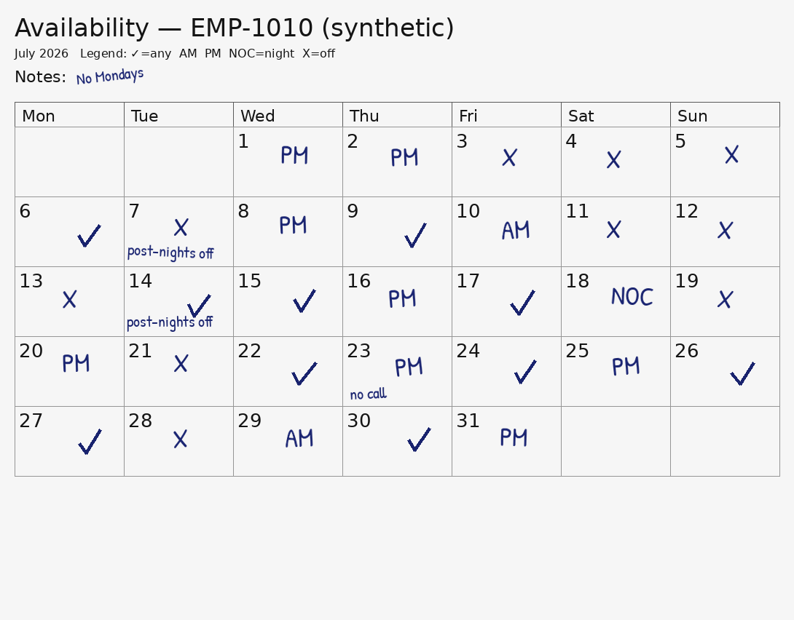

# ED Availability Intake — an LLM Extraction Eval
**Building LLM Evals for Emergency Care.** A documented, de-identified evaluation of how reliably — and how *safely* — a vision LLM turns a filled-in staff availability calendar into structured scheduling data.

   

**Author:** Galen Coulter-Ledbetter, RN, Paramedic · working ED nurse (Level 2 trauma center), military medicine background, daily multi-EHR and clinical-AI user.

| The input | The question |
|---|---|
|  | A nurse prints a blank month, hand-marks availability, snaps a photo, and emails it. Before any scheduler can use that, something has to **read it correctly**. When an LLM does the reading and gets it wrong — **how wrong, and is the error dangerous?** |

---

## Results

<!-- RESULTS_TABLE_PLACEHOLDER — populated from results/summary.md after the scored run.
     Headline: critical-error rate first, raw and honest. Charts from results/charts/. -->
> **Status:** dataset and harness complete; scored run pending. This section receives the real numbers — including failures — when the run lands. No results will be summarized, smoothed, or cherry-picked.

---

## The headline metric: the dangerous flip
Not all misreads are equal. A model that reads `AM` as `PM` dirties the data. A model that reads **UNAVAILABLE as available** puts a body on the schedule that isn't there — a phantom nurse, an unstaffed ED shift discovered at shift change instead of at planning time. That `UNAVAILABLE → available` flip is this eval's **critical-error rate**, weighted and reported separately from ordinary accuracy, because it's the patient-safety-analog failure mode.

## The task under test
**Input:** an image of a filled-in monthly availability calendar.
**Output:** structured JSON.

```json
{
  "month": "2026-07",
  "days": {
    "2026-07-01": { "status": "PM", "note": "" },
    "2026-07-02": { "status": "UNAVAILABLE", "note": "no call" }
  },
  "global_notes": ["No weekends"]
}
```
`status ∈ {AVAILABLE, AM, PM, NIGHT, UNAVAILABLE}` (AVAILABLE = any shift). Calendar legend: `✓=any  AM  PM  NOC=night  X=off`.

*Schema note:* the rendered calendars carry a synthetic employee ID as visual decoration, but it is not part of the labeled ground truth, so it is deliberately **not** in the required output schema. Stated here because silently dropping it would be the kind of drift an eval exists to catch.

## Synthetic data with free ground truth (the design move)
`generate_dataset.py` *generates* each availability pattern first, then renders it to an image — so every calendar ships with its **exact** ground-truth JSON. No manual labeling, no real data, no PHI possible by construction, and the whole 40-case dataset is **byte-for-byte reproducible** from a single seed (`--seed 7`, verified). Difficulty is varied in slices so failures can be attributed:

| Slice | What it simulates |
|---|---|
| `clean` | typed codes, straight scan |
| `rotated` | photographed at an angle |
| `lowcontrast` | faint scan / poor lighting |
| `handwritten` | pen-filled printed calendar — handwriting font, per-mark jitter, stroke-drawn check marks |

## Metrics & rubric
Per case, then aggregated per slice and overall:
1. **Day-level accuracy** — % of days with correct `status`.
2. **Critical-error rate** *(headline)* — `UNAVAILABLE → available-of-any-kind` flips, per gold-UNAVAILABLE day.
3. **Hallucination rate** — notes asserted that aren't on the page.
4. **Note fidelity** — gold notes captured (normalized match; optional `--judge` adds an LLM-as-judge pass, reported separately, bias acknowledged).
5. **Format validity** — parsed, schema-conforming, all days present, statuses in enum. A case that fails twice scores as format-invalid — it is not dropped.
6. **Robustness delta** — accuracy on `clean` minus each degraded slice.

## How to run
Stdlib-only Python (matplotlib needed only for charts). Extraction never sees gold labels; scoring never calls the API. The key is read from an environment variable only — never a file, never an argument, never logged.

```bash
python3 generate_dataset.py --n 40 --seed 7     # rebuild the dataset (or use data/ as shipped)

export ANTHROPIC_API_KEY=...                     # or OPENAI_API_KEY for gpt-* models
python3 run_eval.py --model claude-sonnet-5 --limit 4   # cheap sanity run first
python3 run_eval.py --model claude-sonnet-5             # full 40-case run
python3 run_eval.py --model gpt-4o                       # provider inferred from model string

python3 make_charts.py                           # renders results/charts/*.png
```
Outputs: `results/metrics.json` (aggregates), `results/per_case.csv` (row-level), `results/summary.md` (README-ready table), `results/raw/` (raw model output per case, gitignored).

*Cross-provider note:* the Anthropic path is exercised in the published run; the OpenAI path is implemented to spec but community-tested — open an issue if it misbehaves.

## Failure modes watched for
AM/PM/NOC confusion · date–cell misalignment (off-by-one weeks) · ambiguous-mark misreads · skew/rotation drops · faint-mark omissions · handwriting misreads · note truncation · invented notes. Each observed failure gets a concrete case in [`analysis.md`](analysis.md) with the **operational consequence stated in staffing terms**.

## Proposed guardrails (the clinician's recommendations)
Per-day confidence scores routing low-confidence cells to human confirm · **employee e-confirmation** of the parsed result before it enters the scheduler (closes the loop on the dangerous flip) · schema + sanity validators (reject a parse that marks a whole month AVAILABLE) · re-prompt or second-model vote on low-confidence cells.

## Why an eval, not just a demo
A working tool proves *"I can build."* An eval proves *"I can validate a model and find where it's unsafe"* — the actual day job of clinical-AI reviewer / SME / validation roles. The skill demonstrated — messy document → structured data, then rigorously measure the failure modes — is the same muscle ambient-scribe and clinical-document-AI teams (Abridge, Nabla, Suki, Nuance/DAX) hire for. Swap "availability calendar" for "scanned referral" or "faxed records" and this is that pipeline.

## Product vision (what this is the front door of)
The full tool is an ED scheduling system: ingests availability in whatever form it arrives, maps the scheduling period, projects daily assignments, adapts to callouts / census swings / travel-contract turnover / orientation double-assignments, and surfaces holes before they happen. That's a constraint-optimization + integration build. **This eval is Phase 1: prove the data going in is read correctly and safely** — an optimizer fed bad intake produces confidently wrong schedules.

## Honest limitations
Synthetic calendars — even the handwritten slice — are cleaner and more uniform than real-world artifacts; reported accuracy is an **upper bound**. Single-model, single-run results unless the variance check is reported. LLM-as-judge (optional) shares a family with the model under test. Single-author rubric. Stated, not hidden — naming the limits is part of the competency.

## Repo layout
```
ed-availability-intake-eval/
├── README.md
├── LICENSE                # MIT (bundled font: SIL OFL 1.1, see assets/fonts/OFL.txt)
├── generate_dataset.py    # synthetic calendars + ground-truth JSON (seeded, reproducible)
├── run_eval.py            # extraction harness + scoring (Anthropic | OpenAI)
├── make_charts.py         # results charts (matplotlib)
├── assets/fonts/          # Patrick Hand (OFL 1.1) for the handwritten slice
├── data/                  # 40 generated images + .gold.json (regenerable)
├── results/               # metrics.json, per_case.csv, summary.md, charts/
└── analysis.md            # failure-mode writeup traced to per_case.csv rows
```

## Roadmap
- [x] Spec + synthetic generator
- [x] 40-case dataset across 4 difficulty slices (incl. handwritten)
- [x] Extraction + scoring harness, dual-provider
- [ ] Scored run + charts
- [ ] Failure-mode analysis + guardrails (`analysis.md`)
- [ ] Run-to-run variance check
- [ ] 2-page PDF case study + LinkedIn Featured post

---
*100% synthetic data. No PHI, no employer data, no real schedules — by construction, not by policy.*
